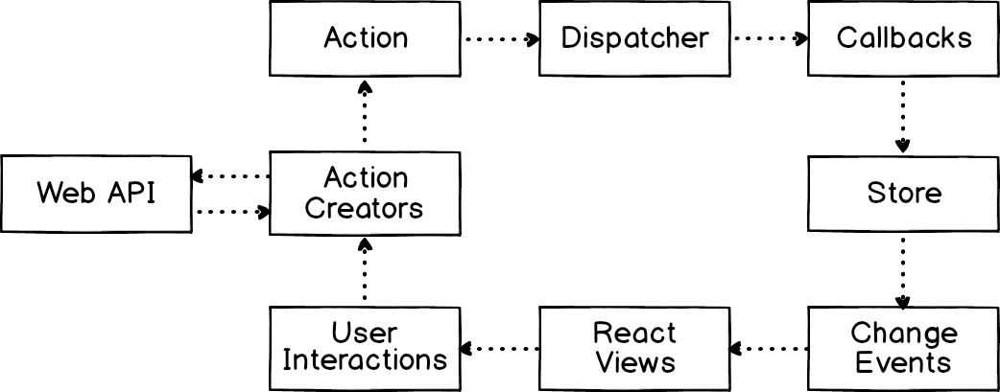

# Introduction

## Why this tutorial?

While trying to learn Redux, I realized that I had accumulated incorrect knowledge about flux through articles I read and personal experience. I don't mean that articles about flux are not well written but I just didn't grasp concepts correctly. In the end, I was just applying documentation of different flux frameworks (Reflux, Flummox, FB Flux) and trying to make them match with the theoretical concept I read about (actions / actions creators, store, dispatcher, etc).

Only when I started using Redux did I realize that flux is more simple than I thought. This is all thanks to Redux being very well designed and having removed a lot of "anti-boilerplate features" introduced by other frameworks I tried before. I now feel that Redux is a much better way to learn about flux than many other frameworks. That's why I want now to share with everyone, using my own words, flux concepts that I am starting to grasp, focusing on the use of Redux.

## Unidirectional data flow

You may have seen this diagram representing the famous unidirectional data flow of a flux application:



In this tutorial we'll gradually introduce you to concepts of the diagram above. But instead of trying to explain this complete diagram and the overall flow it describes, we'll take each piece separately and try to understand why it exists and what role it plays. In the end you'll see that this diagram makes perfect sense once we understand each of its parts.

## Flux

But before we start, let's talk a little bit about why flux exists and why we need it. Let's pretend we're building a web application. What are all web applications made of?

1. Templates / html = View
2. Data that will populate our views = Models
3. Logic to retrieve data, glue all views together and to react accordingly to user events, data modifications, etc. = Controller

This is the very classic MVC that we all know about. But it actually looks like concepts of flux, just expressed in a slightly different way:
* Models look like stores
* User events, data modifications and their handlers look like ```"action creators" -> action -> dispatcher -> callback```
* Views look like React views (or anything else as far as flux is concerned)

So is flux just a matter of new vocabulary? Not exactly. But vocabulary DOES matter, because by introducing these new terms we are now able to express more precisely things that were regrouped under various terminologies. For example, isn't a data fetch an action? Just like a click is also an action? And a change in an input is an action too. Then we're all already used to issuing actions from our applications, we were just calling them differently. And instead of having handlers for those actions directly modify Models or Views, flux ensures all actions go first through something called a dispatcher, then through our stores, and finally all watchers of stores are notified.

## Flux vs MVC

To get more clarity how MVC and flux differ, we'll take a classic use-case in an MVC application. In a classic MVC application you could easily end up with:
1. User clicks on button "A"
2. A click handler on button "A" triggers a change on Model "A"
3. A change handler on Model "A" triggers a change on Model "B"
4. A change handler on Model "B" triggers a change on View "B" that re-renders itself

Finding the source of a bug in such an environment when something goes wrong can become quite challenging very quickly. This is because every View can watch every Model, and every Model can watch other Models, so basically data can arrive from a lot of places and be changed by a lot of sources (any views or any models).

Whereas when using flux and its unidirectional data flow, the example above could become:
1. User clicks on button "A"
2. A handler on button "A" triggers an action that is dispatched and produces a change on Store "A"
3. Since all other stores are also notified about the action, Store B can react to the same action too
4. View "B" gets notified by the change in Stores A and B, and re-renders

See how we avoid directly linking Store A to Store B? Each store can only be modified by an action and nothing else. And once all stores have replied to an action, views can finally update. So in the end, data always flows in one way:

```
action -> store -> view -> action -> store -> view -> action -> ...
```

Just as we started our use case above from an action, let's start our tutorial with actions and action creators.

Go to next tutorial: [Simple Action Creator](01_simple-action-creator.md)
